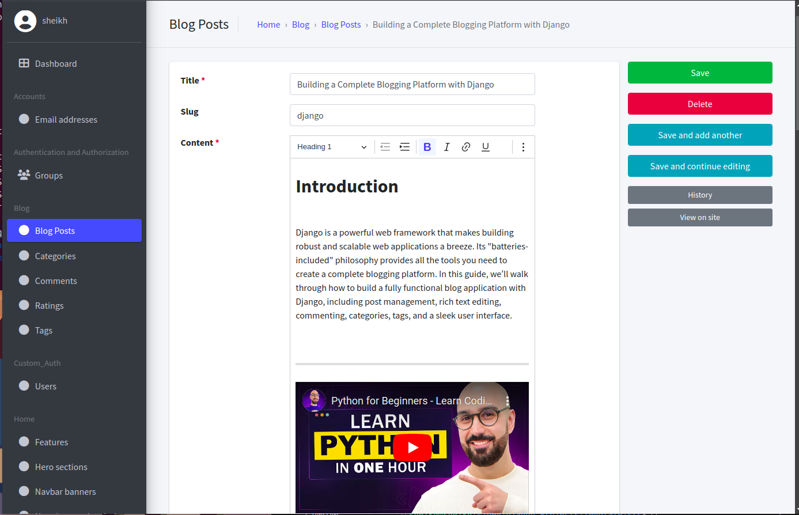
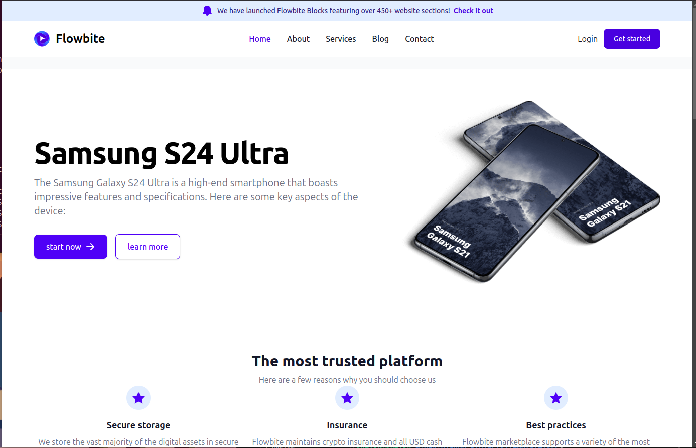

# Django SaaS Application


Welcome to the Django SaaS project! This application is a scalable software-as-a-service (SaaS) platform built with Django. It features user authentication, blog functionality, working contact page and more. Below you will find details about the project structure, core features, and setup instructions to get started.
## Description

### DEMO: [Google Drive Clone]()

<table width="100%"> 
<tr>
<td width="50%">      
&nbsp; 
<br>
<p align="center">
  ADMIN
</p>
<kbd></kbd>
</td> 
<td width="50%">
<br>
<p align="center">
  CLIENT
</p>
  
</td>
</table>

## Table of Contents
1. [Project Overview](#project-overview)
2. [Features](#features)
3. [Project Structure](#project-structure)
4. [Installation](#installation)
5. [Usage](#usage)
6. [Technologies Used](#technologies-used)

## Project Overview
This Django SaaS platform includes several core features that are essential for a SaaS application. This project can serve as a template for a wide variety of SaaS applications.

## Features
- **Custom User Authentication**: Registration, login, email verification, password reset, and profile management using Django Allauth.
- **Pages Module**: Static pages such as FAQs, About Us, and Contact are handled through the `pages` app.
- **Admin Interface**: Customizable Django admin panel to manage all models and users.
- **Responsive Frontend**: Frontend designed using Tailwind CSS and Flowbite components.
- **Error Handling**: Graceful error handling with custom error pages.

## Project Structure
The project is organized into several Django apps, each handling a distinct feature:

```
.
├── README.md
└── src
    ├── core
    ├── custom_auth
    ├── home
    ├── pages
    ├── templates
    ├── utils
    ├── blog
    ├── .env
    └── manage.py

└── venv

```


- **core**: Contains main project settings, URLs, WSGI, and ASGI configurations.
- **custom_auth**: Handles user registration, login, profile updates, and authentication utilities.
- **home**: Manages homepage views, static pages, and general content.
- **pages**: Handles additional static pages, including error handling.
- **templates**: Contains reusable HTML templates for the frontend.
- **utils**: Contains utility functions and reusable scripts (e.g., authentication helpers).

## Installation
To set up the project locally, follow these steps:

1. **Clone the repository**:
   ```sh
   git clone https://github.com/your-username/django-saas.git
   cd django-saas
   ```

2. **Set up a virtual environment**:
   ```sh
   python3 -m venv venv
   source venv/bin/activate
   ```

3. **Install dependencies**:
   ```sh
   cd src
   pip install -r requirements.txt
   ```

4. **Configure environment variables**:
   Create a `.env` file in the root directory and add the necessary environment variables:

   - `DJANGO_SECRET_KEY`="xyz"
   - `DJANGO_DEBUG`=0
   - `EMAIL_BACKEND`="django.core.mail.backends.smtp.EmailBackend"
   - `EMAIL_HOST`="smtp.gmail.com"
   - `EMAIL_PORT`=587
   - `EMAIL_USE_TLS`=True
   - `EMAIL_HOST_USER`="abcd@gmail.com"
   - `EMAIL_HOST_PASSWORD`="pass"
   - `DEFAULT_FROM_EMAIL`=""
   - `SUPPORT_TEAM_EMAIL`=""
   - `GOOGLE_CLIENT_ID`=""
   - `GOOGLE_CLIENT_SECRET`=""
   - `DJANGO_ALLOWED_HOSTS`="127.0.0.1,domain/ip"

5. **Apply migrations**:
   ```sh
   python manage.py migrate
   ```

6. **Create a superuser** to access the admin panel:
   ```sh
   python manage.py createsuperuser
   ```

7. **Run the server**:
   ```sh
   python manage.py runserver
   ```

8. **Access the application**:
   Open your browser and go to `http://127.0.0.1:8000/`.

## Usage
- **Homepage**: Navigate to the homepage to view available products, courses, and services.
- **User Authentication**: Register and log in to access personalized features.
- **Profile Management**: Update your profile information from the profile page.
- **Admin Access**: Access the admin panel at `/admin/` to manage the content and users.

## Technologies Used
- **Backend**: Django 5.1.4
- **Frontend**: HTML, Tailwind CSS, Flowbite components
- **Database**: SQLite (default, can be replaced with PostgreSQL or MySQL)
- **Authentication**: Django Allauth for user management
- **Other**: JavaScript for interactivity, Flowbite for enhanced styling and components

Feel free to contribute by submitting pull requests or reporting issues.

## Issues to fix 

   1. **Customise AllAuth Email Verification**: Improve the email verification flow to better match your application’s requirements.
   2. **Errors/Success Messages in Auth Pages**: Ensure proper display of error and success messages in authentication pages.
   3. **Use Utils for Custom Email Templates**: Centralize email template logic by leveraging utility functions.
   4. **Profile – Add Photo**: Allow users to upload and manage profile pictures.
   5. **Make Services Page Dynamic**: Implement dynamic rendering of services based on database or CMS content.
   6. **Improve Newsletter**: Use a modular approach to enhance the newsletter feature.
   7. **Make Delete Account a Soft Delete**: Convert account deletion into a soft delete with verification requirements.
   8. **Frontend Changes**: Apply necessary improvements to frontend pages for better UI/UX.


